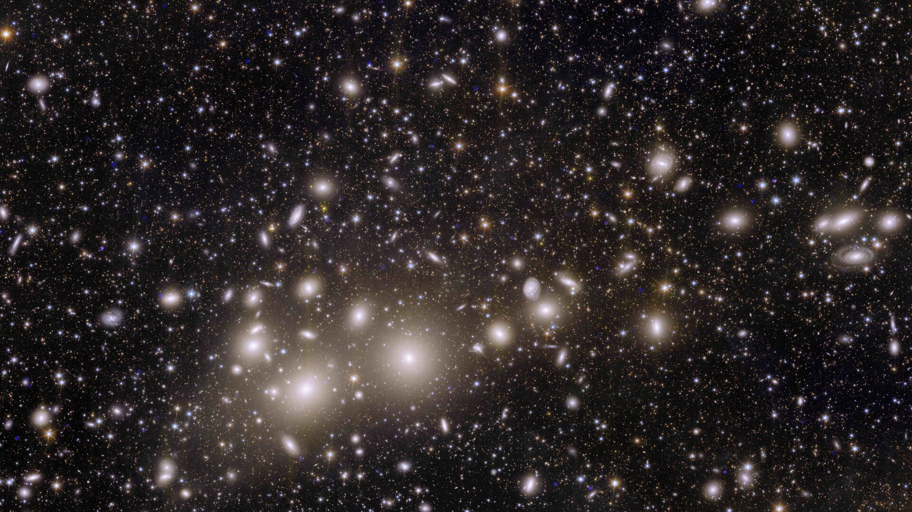

# Stellar Drift: The Euclid Quenching Challenge

A machine learning challenge on galaxy evolution: predict the probability that a galaxy is **quenched** (not actively forming stars) from Euclid-style survey observables under class imbalance and redshift shift.



*Figure 1. Euclid view of the Perseus Cluster, illustrating the kind of wide-field extragalactic observations that motivate this challenge.*

## Challenge Summary

- Task: binary probabilistic classification (`p_quenched` in `[0,1]`)
- Domain: astrophysics + tabular ML
- Core difficulty: severe class imbalance, missing values in external optical bands, and domain shift across redshift
- Competition title in config: `Stellar Drift: The Euclid Quenching Challenge`

## What Participants Predict

Submit a CSV with exactly:

```csv
object_id,p_quenched
12345,0.083
12346,0.912
12347,0.301
```

- `object_id`: galaxy identifier
- `p_quenched`: predicted probability for class `y_quenched = 1`

## Data Layout

- `dev_phase/input_data/train/train_features.csv`: training features
- `dev_phase/input_data/train/train_labels.csv`: training labels
- `dev_phase/input_data/test/test_features.csv`: public test features
- `dev_phase/reference_data/test_labels.csv`: public test labels (for local scoring)
- `final_phase/input_data/private_test_features.csv`: private test features
- `final_phase/reference_data/private_test_labels.csv`: private test labels (for local final evaluation)

## Repository Structure

- `competition.yaml`: Codabench competition definition
- `ingestion_program/`: runs participant submissions and produces predictions
- `scoring_program/`: evaluates predictions and writes scores JSON
- `solution/submission.py`: sample submission interface (`get_model`)
- `pages/`: challenge pages shown on the competition site
- `tools/`: helper scripts for data setup, bundle creation, and Docker testing

## Evaluation

The scoring program computes:

- Primary: macro redshift class-balanced weighted log loss (lower is better)
- Secondary: AUPRC (higher is better)
- Tertiary: recall at fixed precision threshold (as implemented in `scoring_program/scoring.py`)

## Quickstart (Local)

### 1) Install dependencies

```bash
pip install -r requirements.txt
```

### 2) Run ingestion (train + predict)

```bash
python ingestion_program/ingestion.py --data-dir dev_phase/input_data/ --output-dir ingestion_res/ --submission-dir solution/
```

### 3) Run scoring

```bash
python scoring_program/scoring.py --reference-dir dev_phase/reference_data/ --output-dir scoring_res/ --prediction-dir ingestion_res/
```

### 4) Build bundle for Codabench

```bash
python tools/create_bundle.py
```

## Submission Contract

Your submission must expose `get_model` in `solution/submission.py` and return a scikit-learn compatible estimator that can be fit and used for probabilistic prediction.

## Acknowledgement

This project uses Euclid Q1 data products from the Euclid mission (European Space Agency, ESA).

If you use this challenge dataset or derived results in a publication, please acknowledge and cite:

- **Euclid Collaboration**, *Euclid Quick Data Release (Q1) - Data release overview*, arXiv:2503.15302 (2025).
  https://arxiv.org/abs/2503.15302
- Euclid Q1 mission data release DOI: https://doi.org/10.57780/esa-2853f3b

Please also acknowledge the **Euclid Collaboration / mission team** in resulting publications.
